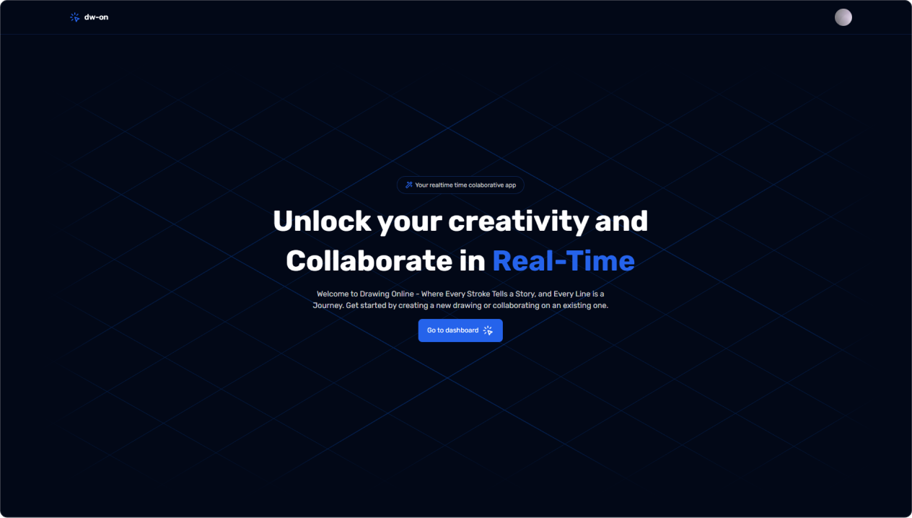

# 👋 Welcome to Drawing Online

Drawing Online is a real-time collaborative application where users can create diagrams, shapes, and drawings directly in the browser. Similar to Excalidraw or Paint, this intuitive and accessible tool fosters creativity and collaboration in visual projects effortlessly.

## 📣 Features

- **[🔁 Real-time Collaboration]**
- **[✍ Draw, Style and Create]**
- **[🔨 Working for more]**

## 🛠 Technologies Used

- HTML
- TalwindCSS
- TypeScript
- Next.js
- Git / GitHub
